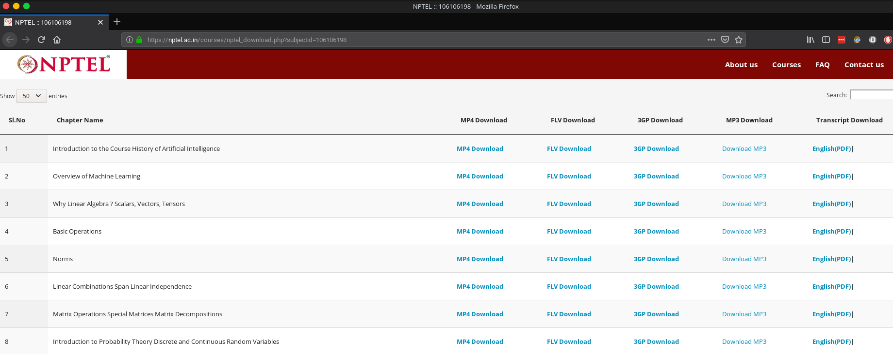
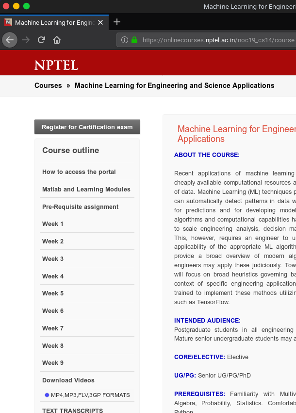
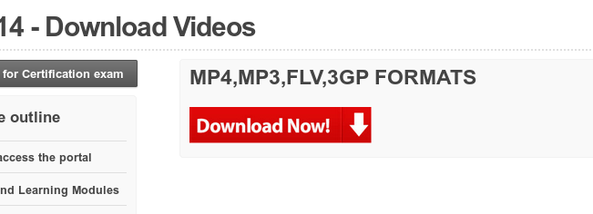
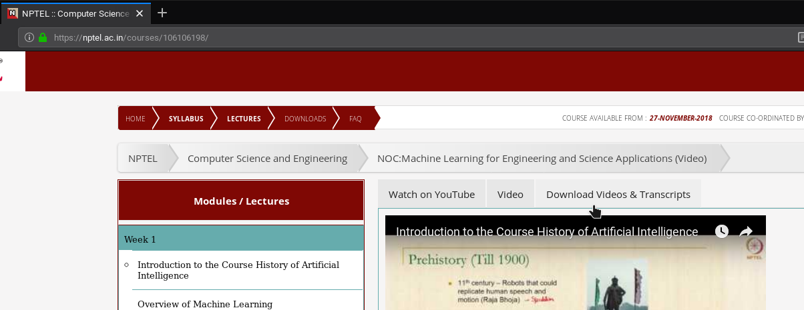
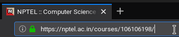

## How to reach the download page ?

The resourses are available to download from the link - nptel.ac.in/courses/nptel_download.php?subjectid=[Course ID] \
Eg - https://nptel.ac.in/courses/nptel_download.php?subjectid=106106198

 

### Step 1
To reach this page first go to the main course page

And click on **Download Videos** And select `MP4,MP3,FLV,3GP FORMATS`

 

### Step 2 

Click on `Download Now`

 

### Step 3

Either click on `Download Videos & Transcripts` and it will redirect you to the downlad page

**OR**

From the url select the Subject ID (Here it is `106106198`) and copy it to https://nptel.ac.in/courses/nptel_download.php?subjectid=`[Subject ID]`