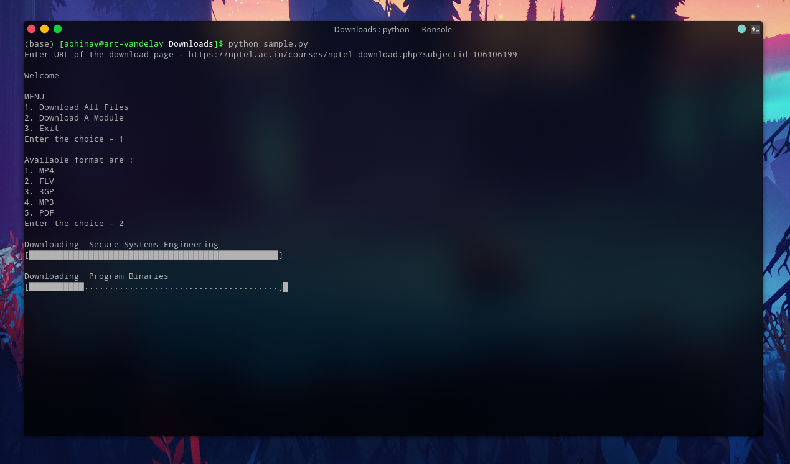

# NPTEL Resource Downloader
Python Script to download resources from NPTEL in all formats available
 


<br>

## Basic Information

Before we get started, ensure that you have installed Python3 on your machine.

### Modules Required
1.  Beautiful Soup
2. Requests


### Formats

_The available formats for downloading are_ 
+ Video
  - MP4
  - FLV
  - 3GP
+ Audio
  - MP3
+ Transcript
  - PDF

### Download Page
The resourses are available to download from the link - nptel.ac.in/courses/nptel_download.php?subjectid=[Course ID] \
Eg - https://nptel.ac.in/courses/nptel_download.php?subjectid=106106198

For steps to reach to this website, [Click this Link](Link.md)

<br>

## Code Instruction

1. Include `main.py` in your file
    ```python
    from main import nptel as nptel
    ```

<br>

2. Create a object with url of the download page
    ```python
    Download = nptel("https://nptel.ac.in/courses/nptel_download.php?subjectid=106106198")
    ```

<br>

3. `ObjectName.getLinks(Format of the content, 'mod'+(Week Number))` returns the download links of all the videos of the specified format and provied week 
   
   ```python
    Links = Download.getLinks('mp4','mod03')
    ```
    For weeks you can use `'mod'+"%02d"%(Week Number)` to automatically format the week number.

    For downloading a specific format use the corresponding string given below :
    - MP4 -> `'mp4'`
    - FLV -> `'flv'`
    - 3GP -> `'3gp'`
    - MP3 -> `'mp3'`
    - PDF -> `'English'`

    
    _**Note**_
    + If all videos of the format are to be downloaded just pass the format to .getLinks
    ```python
    Links = Download.getLinks('mp4')
    ```
    + **PDF can only be downloaded fully** and not week wise.

<br>

3. Downloading from the link

    After step 2 the download links are stored on to an array. To download them pass each url to `nptel.download(URL,Filename)`

    **Note** 
    + PDF \
    The List of urls of pdf files contain the complete link to the file
    ```python
    >>> Links = Download.getLinks('English')
    >>> Links[0]
    'https://nptel.ac.in/courses/pdf_download.php?&subjectId=106106198&lectid=1&lang=English'
    ```
    
    _Example_
    
    ```python
    count = 1
    for url in Links:
        print('\nDownloading PDF ',count)
        nptel.download(url , str(count)+'.'+'pdf')
        count = count + 1
    ```
    <br>
    
    + All other files except PDF \
    The List of urls of files contain only a partial link to the file
    ```python
   >>> Links = Stream.getLinks('mp4')
   >>> Links[0]
   '/courses/download_mp4.php?subjectId=106106198&filename=mod01lec01.mp4&subjectName=Introduction to the Course History of Artificial Intelligence'
    ```
    Therefore we have to add 'https://nptel.ac.in/' while passing with the url nptel.download() \
    <br>
    _Example_ \
    Here the file name is obtained from the url by slicing it.
    ```python
    count = 0
    for url in Links:
      print('\nDownloading ',Links[count].split('=')[3])
      nptel.download('https://nptel.ac.in/'+ url , str(count+1)+"."+Links[count].split('=')[3]+'.'+format)
      count = count + 1
    ```
